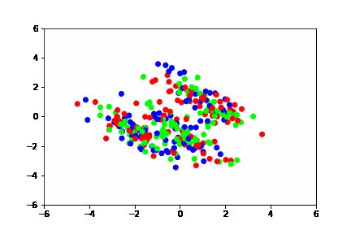
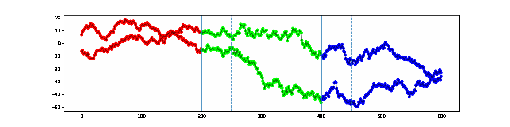

# 一般化ベイズ法によるベイズモデルフリークラスタリングの実装

## 実装と実行例

### クラスタリング

[bayesian-model-free-clustering.ipynb](bayesian-model-free-clustering.ipynb)

### 時系列データのセグメンテーション

[bayesian-model-free-clustering-segmentation.ipynb](bayesian-model-free-clustering-segmentation.ipynb)

## 参考文献

[Bissiri, P. G., et al. “A General Framework for Updating Belief Distributions.” Journal of the Royal Statistical Society. Series B (Statistical Methodology), vol. 78, no. 5, 2016, pp. 1103–30. JSTOR, http://www.jstor.org/stable/44682909. Accessed 26 May 2022.](https://www.jstor.org/stable/44682909)
